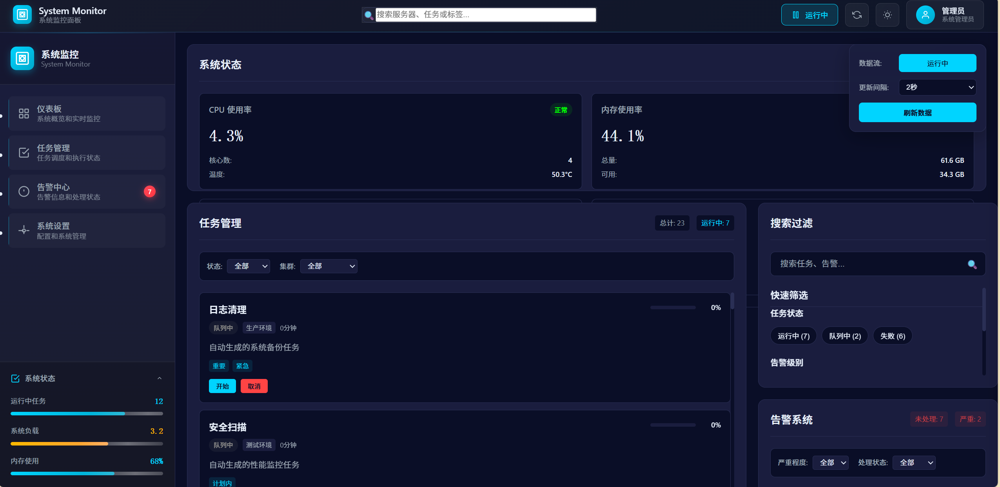

# 系统监控面板



## 📖 设计说明

### 🛠️ 技术选型

本项目采用React 18 + TypeScript + Vite作为基础技术栈，使用Zustand进行状态管理，ECharts实现数据可视化，SASS处理样式，确保了高性能、类型安全和开发效率。

### 🤖 AI使用方式

通过6A工作流（Align、Architect、Atomize、Approve、Automate、Assess）进行项目开发。执行开发AI负责需求分析、架构设计、任务拆分、代码实现和质量评估，实现了高效的自动化开发流程。采用Claude Code+GLM4.5和Trae-CN内置的GLM4.5模型进行综合开发，主要有如下考虑，Claude Code+GLM4.5具有极强的上下文能力，可以处理长文本，工作流清晰；使用Trae-CN内置的GLM4.5模型进行文档撰写，可视性强，交互性好。

### 🎯 关键收获

模块化设计提高了代码可维护性，TypeScript类型系统增强了代码健壮性，实时数据流管理实现了流畅的用户体验，响应式设计确保了多设备适配，AI辅助开发显著提升了开发效率和质量。

## ✨ 主要功能

- **🖥️ 实时系统监控**：监控CPU、内存、磁盘、网络等系统资源使用情况
- **📋 任务管理**：创建、查看、更新和删除任务，跟踪任务进度和状态
- **🚨 告警系统**：实时显示系统告警信息，支持告警确认和处理
- **📊 数据可视化**：通过图表直观展示系统指标、任务进度和告警趋势
- **🔍 搜索过滤**：支持实时搜索和多条件过滤，快速定位所需信息
- **🎨 主题切换**：支持深色/浅色主题切换，适应不同使用环境

## 🛠️ 技术栈

- **前端框架**：React 18
- **编程语言**：TypeScript
- **构建工具**：Vite
- **状态管理**：Zustand
- **图表库**：ECharts 5 + echarts-for-react
- **路由管理**：React Router v6
- **样式方案**：SASS + CSS Modules
- **工具库**：date-fns, lodash, classnames
- **开发工具**：ESLint, Prettier

## 📁 项目结构

```
system-monitoring-panel/
├── public/                 # 静态资源
├── src/
│   ├── components/         # 组件目录
│   │   ├── charts/         # 图表组件
│   │   ├── dashboard/      # 仪表板组件
│   │   ├── layout/         # 布局组件
│   │   └── ui/             # 通用UI组件
│   ├── pages/              # 页面组件
│   ├── hooks/              # 自定义Hooks
│   ├── store/              # 状态管理
│   ├── utils/              # 工具函数
│   ├── types/              # TypeScript类型定义
│   ├── services/           # 数据服务
│   ├── styles/             # 样式文件
│   ├── constants/          # 常量定义
│   ├── App.tsx             # 应用根组件
│   ├── main.tsx            # 应用入口
│   └── routes.tsx          # 路由配置
├── .eslintrc.cjs           # ESLint配置
├── .gitignore              # Git忽略文件
├── index.html              # HTML模板
├── package.json            # 项目依赖
├── tsconfig.json           # TypeScript配置
├── vite.config.ts          # Vite配置
└── README.md               # 项目说明
```

## 🚀 快速开始

### 环境要求

- Node.js >= 16.0.0
- npm >= 7.0.0

### 安装依赖

```bash
npm install
```

### 启动开发服务器

```bash
npm run dev
```

### 构建生产版本

```bash
npm run build
```

### 预览生产版本

```bash
npm run preview
```

### 代码检查

```bash
npm run lint
```

## 🔧 端口配置

- **开发服务器端口**：5173
- **预览服务器端口**：4173

## ⌨️ 快捷键

- **Ctrl/Cmd + S**：保存当前页面
- **Ctrl/Cmd + R**：刷新页面
- **Ctrl/Cmd + F**：打开搜索框
- **Ctrl/Cmd + /**：切换主题

## 📋 功能模块

### 1. 系统监控模块

- **CPU监控**：显示CPU使用率、核心数和温度
- **内存监控**：显示内存使用率、总量和可用量
- **磁盘监控**：显示磁盘使用率、读写速度
- **网络监控**：显示网络上传/下载速度和延迟
- **系统负载**：显示系统平均负载

### 2. 任务管理模块

- **任务列表**：显示所有任务及其状态
- **任务详情**：查看任务详细信息
- **任务创建**：创建新任务
- **任务更新**：更新任务状态和进度
- **任务删除**：删除不需要的任务
- **任务过滤**：按状态、标签等条件过滤任务

### 3. 告警系统模块

- **告警列表**：显示所有告警信息
- **告警详情**：查看告警详细信息
- **告警确认**：确认已处理的告警
- **告警过滤**：按严重程度、来源等条件过滤告警
- **告警趋势**：显示告警趋势图表

### 4. 数据可视化模块

- **系统指标图表**：显示CPU、内存、磁盘、网络等指标的历史趋势
- **任务进度图表**：显示任务完成情况和进度分布
- **告警趋势图表**：显示告警数量和严重程度的变化趋势
- **图表交互**：支持缩放、数据点详情显示等交互功能

### 5. 搜索过滤模块

- **实时搜索**：支持任务、告警等内容的实时搜索
- **多条件过滤**：支持多个过滤条件的组合
- **搜索结果分类**：按类型分类显示搜索结果
- **搜索历史**：保存搜索历史记录

### 6. 主题系统模块

- **深色主题**：默认深色主题，适合监控场景
- **浅色主题**：可选浅色主题，适应不同环境
- **主题切换**：支持一键切换主题
- **主题持久化**：保存用户主题偏好

## 📊 数据模型

### 系统指标 (SystemMetrics)

```typescript
interface SystemMetrics {
  timestamp: Date;
  cpu: { usage: number; cores: number; temperature: number };
  memory: { usage: number; total: number; available: number };
  disk: { usage: number; total: number; available: number; readSpeed: number; writeSpeed: number };
  network: { uploadSpeed: number; downloadSpeed: number; latency: number };
  loadAverage: number;
}
```

### 任务 (Task)

```typescript
interface Task {
  id: string;
  name: string;
  targetCluster: string;
  status: TaskStatus;
  progress: number;
  startTime: Date;
  endTime?: Date;
  tags: string[];
  description?: string;
}
```

### 告警 (Alert)

```typescript
interface Alert {
  id: string;
  timestamp: Date;
  source: string;
  severity: AlertSeverity;
  title: string;
  description: string;
  isAcknowledged: boolean;
}
```

## 🛠️ 开发指南

### 添加新组件

1. 在`src/components`相应目录下创建新组件文件
2. 使用TypeScript定义组件Props类型
3. 实现组件逻辑和样式
4. 导出组件并在需要的地方引入

### 添加新页面

1. 在`src/pages`目录下创建新页面文件
2. 在`src/routes.tsx`中添加新路由
3. 实现页面逻辑和样式
4. 在导航菜单中添加链接

### 添加新图表

1. 在`src/components/charts`目录下创建新图表组件
2. 继承`BaseChart`组件或直接使用ECharts
3. 配置图表选项和数据
4. 在页面中引入并使用图表组件

### 修改主题

1. 在`src/styles/variables.scss`中修改CSS变量
2. 在`src/styles/global.scss`中修改全局样式
3. 在组件中使用CSS变量而非固定值
4. 测试深色和浅色主题下的显示效果

## 🚀 部署指南

### 静态部署

1. 执行`npm run build`构建生产版本
2. 将`dist`目录下的文件部署到静态服务器
3. 配置服务器支持SPA路由（可选）

### 容器化部署

1. 创建Dockerfile
2. 构建Docker镜像
3. 运行Docker容器

### 云服务部署

1. 选择云服务提供商（Vercel、Netlify等）
2. 连接代码仓库
3. 配置构建命令和输出目录
4. 部署并配置自定义域名（可选）

## ❓ 常见问题

### Q: 如何添加新的系统指标？

A: 在`src/types/index.ts`中扩展SystemMetrics接口，在`src/services/MockDataGenerator.ts`中添加相应的数据生成逻辑，然后在图表组件中添加新的图表类型。

### Q: 如何修改数据更新频率？

A: 在`src/services/DataStreamService.ts`中修改updateInterval参数，默认为2000毫秒（2秒）。

### Q: 如何自定义图表样式？

A: 在图表组件中修改echartsOption配置，或创建自定义主题并应用到图表中。

### Q: 如何添加新的告警类型？

A: 在`src/types/index.ts`中扩展AlertSeverity类型，在告警组件中添加相应的处理逻辑。

## 🤝 贡献指南

1. Fork项目
2. 创建功能分支
3. 提交更改
4. 推送到分支
5. 创建Pull Request

## 📄 许可证

MIT License

## 📧 联系方式

如有问题或建议，请通过以下方式联系：

- 邮箱：1930863755@qq.com
- 项目地址：https://github.com/yangwinnietang/system-monitoring-panel